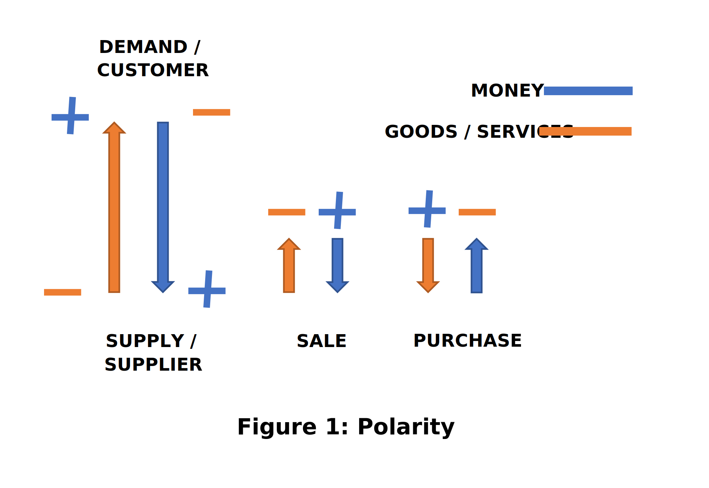
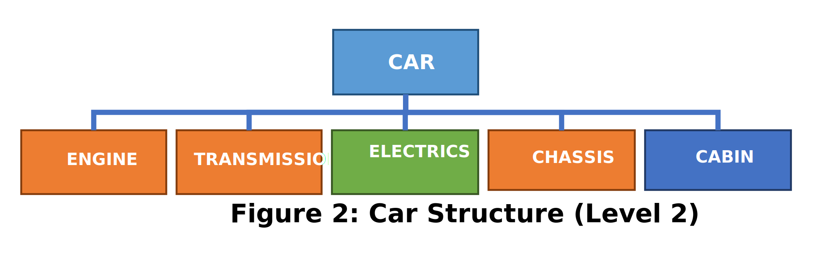
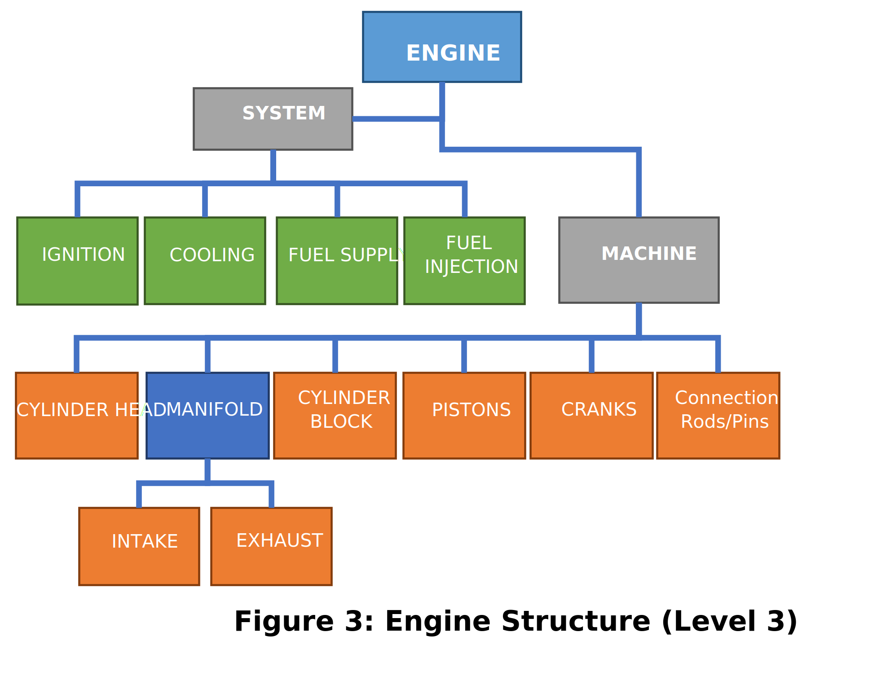
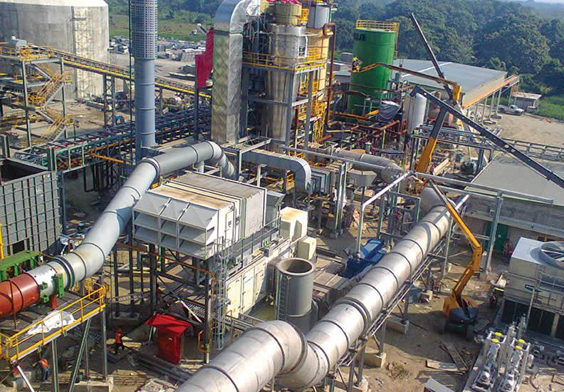
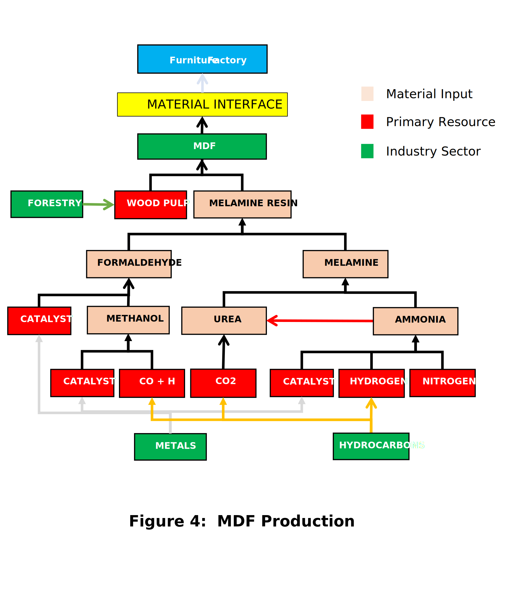
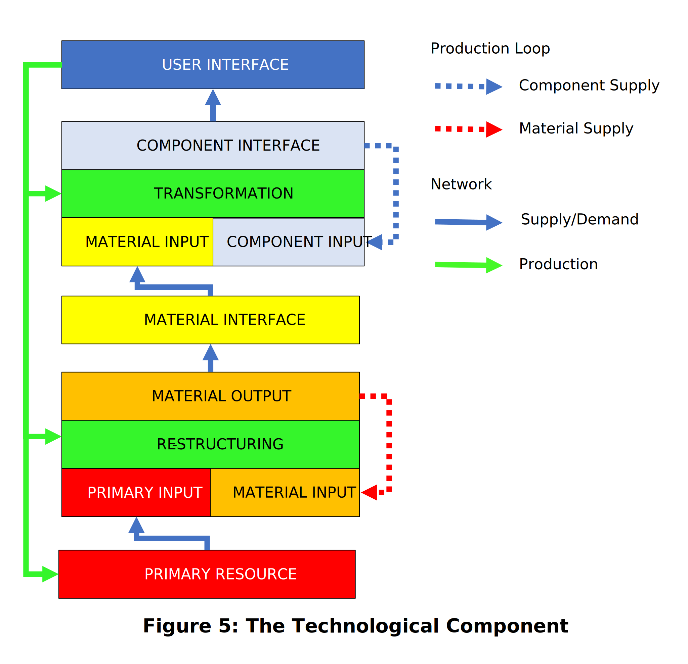
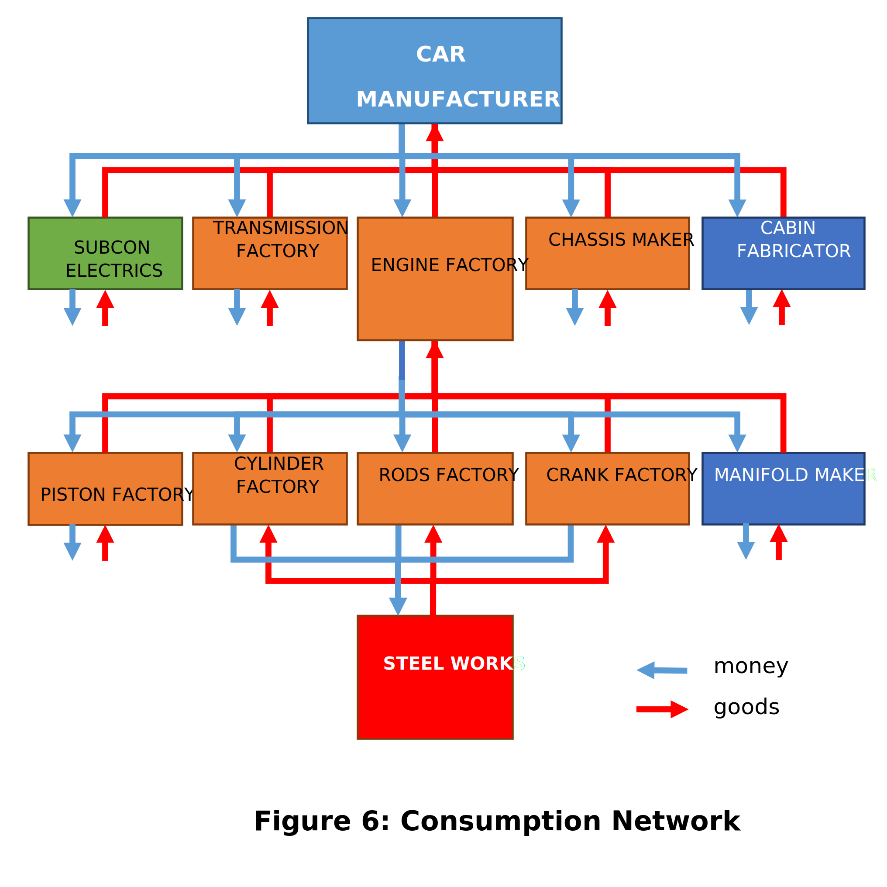
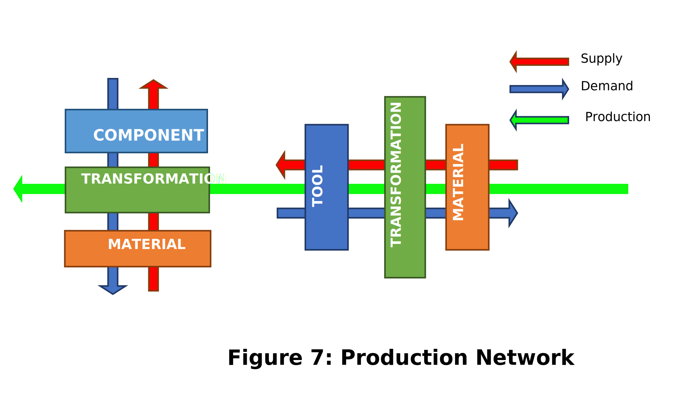
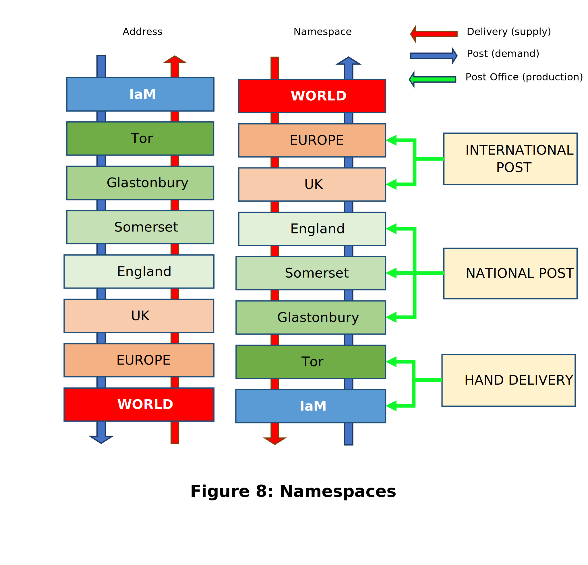
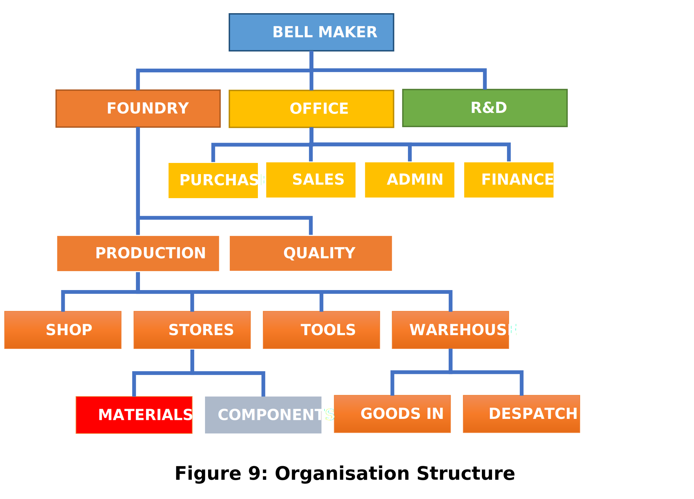

---
layout: page
title: Production Systems
permalink: articles/tc_production
---
Published on 25 November 2019.

Providing insight into the functional dimensions of the schema design and business logic of [Trade Control](https://github.com/tradecontrol).

## Exchange

A central pillar of the design is the way in which [cash polarity](../tutorials/cash-codes#cash-polarity) functions in acts of exchange. 

By tradition, there are separate divisions for buying and selling, called Purchasing and Sales Departments respectively. This made sense, because they involve very different kinds of people with different motivations. Software systems have then naturally evolved to serve the interests of these two groups, resulting in separate Customer Relations Management and/or Procurement modules. This practice creates different interfaces to each activity; and in so doing seals them off, both internally from each other, and externally from their customers and suppliers. To overcome the sealed interfaces problem, various formal procedures have evolved to communicate across the divide. This is visibly apparent in the schema design of ERP systems such as [Dynamics NAV](https://dynamicsdocs.com/nav/2018/w1/).

From a Systems Engineering perspective this arrangement is inefficient and restrictive. Instead of designing systems around the needs of existing departments, it is also possible to target the design around the transactions that take place. Trade Control is designed to not only un-seal these interfaces but to homogenise them so that they can almost disappear. This section explains how.

### Exchange Example

By way of example, a Sales Department publishes its wares in a catalogue. The Purchasing Department of one of their customers browses the catalogue for a requirement. If they find what they want at the right price, they raise a Purchase Order (PO) and send it to the Sales Dept of the supplier. The PO communicates what goods or services are required, in what quantity and at what price. The supplier then raises the PO on their system and sends a Sales Order (SO) to their customer in confirmation. In so doing, a series of events kicks off because the SO constitutes a Demand for Supply. In manufacturing, if the goods are not in stock, they would need to be made, so the SO is presented to the Production Department, who raise a Works Order (WO). The WO requires materials and components, and if they are not in stock either, they requisition Purchasing; who browse the catalogues of other suppliers, and when they find what they want they raise a Purchase Order (PO) and send it to the Sales Department of the supplier. And so, the cycle continues in what is called a Supply Chain.  As each exchange takes place, at the interface between the Purchasing and Sales Departments involved, a Sales Invoice is passed from the Supplier to the Customer, which is then reflected into the Customer’s Purchase Invoice. These too specify the goods or services delivered, in what quantity and at what price. Then the second exchange takes place, the money. 

Examining this Supply Chain example: 

- We can see that exchange is the product of a recursive process, in that as each business repeats the same activity, it proliferates. In Trade Control, it is called the [Workflow](#workflow).  

- Exchange is orchestrated by a series of binary exchanges in exact correspondence - the flow of goods and services downstream to the customers, and the money flowing upstream to the suppliers. For Trade Control, this is modelled by the Workflow's Cash Polarity. 

### Cash Polarity

The figure below is exchange expressed in the perspective of Workflow Polarity; the Sales Order is the same as a Purchase Order, except with reverse polarities (i.e. direction of goods and money).



From this we can deduce two things:

**A.** To change a purchase order into a sales order we just swap the polarity.

**B.** In order to identify who is the customer or supplier and what kind of order it is, we only need to know the direction of either the goods or the money from one of the parties in a binary exchange. It doesn’t matter which because the other is always the opposite polarity. In practice, the money is easier because it is a simple number, while goods and services are more complicated. In the table below, there are two organisations A and B. Only one polarity is required, shown in italic, to determine each party's order and the organisation type. 

 A: CASH | B: CASH | A: QTY  | B: QTY  | A: ORDER | A: TYPE    | B: ORDER | B: TYPE  
 -- | -- | -- | -- | -- | -- | -- | --
 **_NEG_**   |  POS    |   POS   |   NEG   |   PO     |  CUSTOMER  |   SO     |  SUPPLIER  
 POS   | **_NEG_**   |   NEG   |   POS   |   SO     |  SUPPLIER  |   PO     |  CUSTOMER
 
In row 1 the polarity of the cash for organisation A is negative and so money is going from A -> B. Because there is an exchange, the Quantity for A must be positive, and Organisation B must have opposite polarities. So, goods and services are passing from B -> A. Once you know that, you know the roles played by the various identities and their associated order types.


## Workflow 

The Supply Chain in the above example is a sub-set, or instance, of Workflow. The Workflow implementation is explained in the demo [Modelling a Bill of Materials](../tutorials/manufacturing). Before proceeding, unless you are an engineer, it is recommended that you look at the demo to obtain a practical appreciation of what follows.  

### Production

Trade Control is a production system. We tend to regard all technology from a user's perspective, not the producers. Indeed, the famous Turing Test for AI is viewed from this perspective, and we are going to provide a production-based alternative later. In the meantime, it is easy to understand that car drivers have a very different take on their vehicles to those responsible for its manufacture. The user perspective also results in a tendency to identify machines with technology generally, but a simple table is also technology, as is paint on the wall. Both car and table are assemblages made in the Secondary Industry sector; therefore, they are produced the same way, deploying very similar production systems in their factories (the production system for furniture manufacture is actually more complex than that used by the automotive industry, because its underlying data structure is not a simple tree). Furthermore, machines are not the same as technological systems, and nor are they the same as the materials that make them, which are also engineered. The need to provide clear, functional definitions is involved; nevertheless, applying Systems Engineering principles to the production process, we can do this quite simply.

The kind of Workflow in the demo is taking place _inside_ the Node. However, it is possible to externalise the Workflow by connecting nodes in the form of a supply chain. To explain this capability, we are going to continue with the manufacturing theme, and look at the matter in terms of Assemblages. It will also apply to any kind of activity, but services tend to have convoluted supply chains, whereas in manufacturing they are very structured, and hence can be described with greater clarity. We can also example an object that is familiar to all: the car. Because Trade Control is a production system it is also recursive; so, if you have completed the demo, you will know in principle how to model and produce vehicles of any complexity. Trade Control will not, however, orchestrate production inside a real car factory, because it has had the manufacturing side removed. The [sharpNode](https://github.com/iamonnox/tradecontrol/blob/master/src/scripts/sharpNode/sharp_node_2002_03.sql) schema 2002 could achieve this, although it is in an alien language that engineers would not currently appreciate. 

### Assemblages

Although cars may be conceived as an object of desire or utility, what kind of object are they really? The vehicle has a User Interface (UI) wrapped specifically around the human form. You may have obtained skill in its operation, and subject to human laws (the orchestration of the transport system and the highway code) and available resources (time and money), you can drive where you like. In this way, the car is a machine that liberates its users. But human laws must operate within the constraints of the technology, which is constrained in turn by physical law. For use to be possible, there must have been a prior productive process that generated the machine upon which it depends. It is because the UI so perfectly masks machine production, and is indeed designed to do so, that car drivers can be oblivious to the importance of its manufacturing origins and inner workings. The same could be said of Bertrand Russell’s proverbial table that philosophers often use when conceptualising the nature of objects. It is never mentioned that the table is a manufactured object and can therefore be functionally described by engineers, were they required to mass produce them. This is how they go about it.

#### Assemblage Definition

The first thing to understand is that technology has an [internal structure](#component-definition). The car consists of many components and systems working in tandem to materialise a simplified required output (high velocity propulsion and horsepower). You could disassemble your car until you filled the garage with thousands of seemingly unrelated components, most of which, in themselves, are of no deducible purpose. This method is not very informative, because the best way to understand the technology is in terms of assemblages.

Assemblages can be defined by four key facts:

1.	An assemblage is made from components and materials. 
2.	The internal structure of the assemblage is concealed by an external interface.
3.	The interface provides a means to use the assemblage.
4.	The components of an assemblage can be collections of other assemblages.

This definition presents us with corresponding What/How questions:

1.	What is the difference between a component and a material and how do they form assemblies?
2.	What is the internal structure of an assembly and how is it concealed?
3.	What are interfaces and how are they formed?
4.	What is the mechanism by which components use other assemblies and how do they recurse?

To answer these questions, we will further explore the concrete example of car production.

#### Object Structure

The internal structure of a car is represented in **Figure 2** by a Bill of Materials (BOM). This is only a sketch of the real thing, which is of course massive for something as complicated as a car with over 10,000 components, where each node in the tree would represent a unique part with associated properties.



**Figure 2** states that a car requires at least five major assemblages: an engine to provide power; a transmission mechanism to convert that power into propulsion; electrics for requisite electrical systems and equipment; a chassis to support it all, with its wheels and brakes; and finally a cabin, housing the UI.  Each one of these is a layer of abstraction and can therefore be broken down into its own inner machines and systems.  As we are not interested here in describing automotive technology, only assemblage production generally, we explode the BOM a single level more for just one of these assemblages, the engine.  



**Figure 3** separates machines from system components, although likely that would not be done in a real life BOM. In use, machines transform raw inputs into useful output, but structurally they are a collection of components bound into assemblages that can themselves become components. Technological systems bind different machines together allowing new, higher level, assemblages to form or function. That is why machines can contain systems, such as the fuel injection system of a car engine; and systems contain machines, like the pump in the engine’s cooling system.

As we descend levels, we generate a more complex representation of the car’s internal structure. So, at Level 1 there is just one assemblage, the car; at Level 2 there are five. We have exploded just one of those at Level 3 and we now have eleven. We could take any of those assemblages and continue exploding downwards. We won’t because it is just more of the same, but at what point does the feedback loop of components stop? They terminate at the [physical materials](#materials) from which everything is made. 

The production demands for components and materials are very different, resulting in two separate sectors: the Primary Industry for materials (e.g. the metal) and the Secondary Industry for components (e.g. the car). The Secondary Industry needs the materials from the Primary to make stuff, which in turn needs the components of the Secondary for extraction and processing (like mining operations and chemical plants). They are distinguished by their respective outputs. Components have highly specified connectivity potential, such as the car door handle; whereas materials typically have infinite production potential, such as the plastic granules from which the handle has been made.

What you should now be able to do mentally is look at the car and, instead of seeing a single object (as a user), visualise a highly structured upside-down tree containing thousands of objects (as a producer). At the base of the tree’s trunk is the car, at the leaves, materials, and in the middle all the parts that make it. The Bill of Materials you are imagining shows us how a machined object is structured, and we could still describe this in terms of physical relationships, as engineers do in their CAD drawings.

So far, we have described a _spatial definition_ of the cars interconnected components, which is to say, how they relate structurally to one another in layers of abstraction  (BOM Levels). Yet to enter its engineered reality, you must also include production, which takes place in time.

#### Production Process

The BOM can be considered a spatial representation of how physical matter and energy will be structured to meet the purpose of its product (the Level 1 root node).  As such its _structure_ is presented vertically, with the product at the top, and then its lower levels beneath. To interpret the BOM as a production diagram, its _process_ must be presented horizontally, which is quite difficult to do in two dimensions.  The best visualisation tool used by Production Departments for this is the Gannt chart, but even that is limited because the structure is lost. The clearest way is to use imagination.

Firstly, imagine that we have drawn up all 10,000 components of your vehicle with the materials that make them; not in a long list, but structured in layers of abstraction, following the description above, and the illustrations in **Figures 2** and **3**. Then extend the BOM all the way down through the Primary Industry to the [raw materials](#materials) from whence they have been made. Secondly, to reconfigure the representation temporally, imagine there is a giant upside-down tree, and this inverted tree now falls so that it is flat, with the root node furthest off. Instead of a tree describing vehicle structure, it is now like a system of connected rivers describing vehicle production , flowing towards the car at the root of the Spatial Workflow. Right in front of you are all the many physical elements that make up the substance of the car, because they come first. These elements are transformed into usable materials by the Primary Industry. When you are looking at these materials, your car does not in fact exist. What does exist are these processes that begin to transform the material. They pass like waves across the production landscape, forging assemblages; folding the material up over and over, connecting and reforming, reshaping matter, orchestrated by creative intelligence at the service of human need.

It is a spatial representation of time that must begin in earth’s geology, with mining operations. As we venture further out, we encounter the Primary Industries that supply materials, everything needed to make the working machine: chemical refineries, steel plants, plastics and so on. They stoke the factories of the Secondary Industry with materials. Each factory naturally forms around discrete assemblages, like engine manufacture, transforming their materials into a new level of abstraction, and passing it on.  Finally, every river converges on the assembly plant, where the assemblages in **Figure 2** are brought together, and the car is born.

Looking down upon this vision of the humble car, as though from a mountain top, we have a very different vision of its true nature. Below us dwells the flayed body of a transforming, interconnected earth. At our feet, wide open cast mines paraded by driverless trucks with 5 metre wheels; dark caverns deep below ground where diamond encrusted drills are boring out a million tons of rock. Oil rigs float on icy seas, their proboscis dug in, sucking up crude from the depths. In the far distance you discern a speck of dust: your vehicle emerging onto the forecourt, perched on the ledge of a new horizon. It may be for racing: bright light in the firmament burning with desire; or just a delivery van: inconspicuous white cell pottering down the asphalt arteries of the world. Its interface is now connected to the user’s world. We, however, have entered an engineered reality where the possibilities for process and object creation are effectively infinite.

The Spatial Workflow is modelled in the TC-Node by the **Activity** schema; the Temporal Workflow by the **Task** schema.

#### Production Environment

Our imagination has allowed us to find a new perspective on things; but this poet on the mountain top view is very incomplete. Other key processes integral to the car's production are not included in a Temporal Workflow, and a number come to mind:

-	**Feedback Loops**: Materials are the required input for manufacturing technology, but the most sophisticated technology is used in their acquisition. As technology develops, it folds back around its origins, to increase the efficiency of acquisition, and the utility of its materials. Oil refineries provide a good image.
-	**Infrastructure**:  All human enterprise plugs itself into a much greater terrain like the roots of a tree, and manufacturing is the same: energy, communications, transport, sewerage, construction…what everyone knows but takes for granted until it fails.  These are systems as defined earlier. 
-	**Design and Development**: Products and services often have an involved history. This history emerges from ever increasingly abstract strata – the product’s current form, its version history, the range it belongs to, the company’s timeline, its evolving industry sector. Car manufacture can probably trace its history back to the Industrial Revolution. Then there are the ever-emerging technological developments, the application of science and engineering knowledge, the hard-earned skills of their creators…  
-	**Governance**: a system of laws, rules and regulations is imposed to control the production process, at various levels of abstraction – international, national and industry sector. Most manufacturers will also have their own substantial Quality and System Engineering Manuals, to determine due process for both themselves and their suppliers. This framework of governance is ceaselessly evolving.

Whilst these are prerequisites for advanced production, they do not particularly clarify the the Trade Control app. What will help is an understanding of the different networks involved and how they interact. Before that, we need to understand materials and provide a formal, functional description of the technological component.

### Materials

A key objective of the Primary Industry is to generate materials that maximise the potential for component production. This is achieved by applying knowledge obtained from science and engineering about the physical world. Primary production keeps executing a material supply loop until it produces a quality Material Interface (MI). Within the MI the following conditions apply:

1. Physical information uniquely identifies the object (raw material is a re-structuring of matter)
2. Material input dictates product output (physical laws dictate the transformation)
3. All material inputs must be physically restructured (no components)
4. A physical object that maximises and improves further restructuring (primary resource production).

Materials have an interface when they can be used to power a user process (like the petrol in your car) or more interestingly, manufacture components (like an iron horseshoe). Iron ore is a mined material, but it has no interface because you cannot make anything from it. The ore consists of >60% oxidized iron and various slag inclusions. Smelting the ore in a blast furnace separates the iron from the slag. Before the introduction of mild steel, the blacksmith would have worked with wrought iron to make things like horseshoes. It contains trace elements of carbon and slag fibre, making it a highly malleable material when heated in the forge. The material has both an inner chemical structure (99% iron, 0.1 carbon...) and external material properties (tensile, compression and shear strength...); and this reflects our description of the car engine, which also has a concealed inner structure and a set of external component properties. The Component Interface (CI) connects to a higher level of abstraction, whereas the Material Interface (MI) provides the physical means for component abstraction to occur.  As the blast furnace smelts the iron’s MI, so the blacksmith’s forge reveals it. For this reason, the iron’s MI can be supplied by material with a very different internal structure, such as the lighter aluminium used by racehorses.  Although a horseshoe is pre-Industrial Revolution technology and very close to its primary materials, we can still trace the four key stages of assemblage production and their associated [interfaces](#interfaces):

1. Primary material production of the wrought iron ingots. (MI)
2. The blacksmith’s secondary component production of the horseshoes and nails. (CI)
3. Tools for the installation of the shoes – hammers, pincers, files. (TI)
4. The final shoeing of the horse by a farrier, where the horse is the user. (UI)

#### Material Supply Loop

To understand the material supply loop, we need a more complex process; so let's take for our example the afore mentioned philosopher's table and make it out of Medium Density Fibre board (MDF). If you research this board, you will find its manufacture is very involved. Here is a picture of an MDF production plant:



It is not the only plant required, and they all look similar: chimney stacks, piping, tanks and so on, like a chemical laboratory for giants.  These plants are supplied by the Secondary Industry, folded back around its inputs (the green arrow in **Figure 5**). **Figure 4** describes how the Primary Industry puts together this ubiquitous material.



Several points are worth mentioning:

- MDF is dependent upon three other industry sectors
- The substances required are manufactured in their own chemical plants
- The re-structuring process is concealed at the point of material input
- MDF can be substituted with a completely different material that provides a similar interface
- Details of how each plant re-structures its materials are entirely absent
- Material production is in conformity to the [component definition](#component-definition) shown in **Figure 5**

Although it looks like the material is becoming more abstract, that is incorrect. In the Primary Industry, due to physical law, it is a layering and re-structuring process that evolves the material into the required MI. For the furniture factory, the internal structure of the MDF board and its manufacturing processes are not relevant. It presents an [interface](#interfaces) like a piece of paper to an Origami artist, whose folds are limited only by the imagination. But each fold constrains the next; each component conceals itself and presents new options for the application of creativity. Those options are bound by, but also transcend, physical law. New rules are laid down as the production process generates component interfaces of ever-increasing abstraction.

## Components

Components are the fundamental building blocks of any technological infrastructure. To develop a meaningful understanding of technology requires that the component be clearly defined. It is possible to form components [out of subjects](#subjects-and-objects) as well as objects, meaning that [subjects too can be engineered](#organisations), but subjects are not generally regarded in this way. The following definition applies to physical goods only. Today’s technology is heavily computerised on what Computer Science calls Virtual Machines. This output is produced by coders rather than factories, like the Trade Control app itself. However, physical technology is primal. It connects to objective reality in a way that opens a door to the infinitude of the virtual. The following definition tells you why.

### Component Definition

In **Figure 5** the technological component is specified in its most simplified form.



The production loops demonstrate that the component is deeply recursive: components are made from other components, materials from other materials. The MI   is provided by the Primary Industry, the UI by the Secondary. The UI is a Component Interface (CI) with two additional qualities:

1. The UI must connect to a desired user process (e.g. driving your car)
2. It provides the completion point for the design and production process (e.g. the car itself)

As such, the UI is the intersection point for the spatial (design) and temporal (production) workflows. Each CI, however, is concealed inside the structure of the assemblage in which it is used (e.g. the car engine).

The blue line is the production of component structure following the direction of Temporal Workflow. The green line represents [specialised components](#tools) produced in the Secondary Industry, used to make more components, transform materials or extract substance from the earth. Each [interface](#interfaces) conceals the inner structure of both its product and production so that abstraction can take place. Material interface production is determined by physical law, whereas component interfaces are also determined by the rules of abstraction.  When considering the Spatial Workflow of an assemblage, it is possible to consider the leaf nodes as physical material and the component nodes as abstractions; such as those in a CAD drawing. This, however, is a model of the assembly. In the Temporal Workflow that produces the assemblage, the physical material is ever-present throughout the abstraction process. The real assembly is both physical and abstract at the same time.

## Networks

In the section on [Assemblages](#assemblages) we imagined the entire structure and processes that make up a car modelled in a single Bill of Materials. In theory, you could render this model inside the Node, although in practice this is unrealistic; principally because of the fundamental nature of components, but also due to commercial techniques that exploit this. 

The [Trade Control Network](https://tradecontrol.github.io/network) is implemented in Ethereum.

### Consumption Networks

It is the recursive nature of component and material production that proliferates supply chains. Each loop presents the possibility of serving a completely different production process, forming a bifurcation point where dedicated production plants naturally form. **Figure 4** looks like a bill of materials, but equally it describes a supply chain, were each material input is in fact a chemical plant. For example, formaldehyde is not only used to produce melamine resin, so it does not make any sense for the Melamine Resin plant to make it. They do not care how or where the formaldehyde is produced, only that it has the correct material properties for their own product.

Looking back at **Figures 2** and **3**, we can do the same thing in the Secondary Industry. Rather than modelling vehicle structure, it could be conceived as a supply chain. Level 1 is the Assembly Plant, where everything is put together. Level 2 there are separate organisations specializing in each component, like engines. The same could be said for level 3, such as an engineering business making pistons.

Many supply chains are dictated and distorted by Intellectual Property ownership, like patents. Functionally, however, multiple supply chains converge when components service more than one chain. For example, O Rings are widely used in mechanical engineering. It does not make sense for a manufacturer of washing machines to make their own O Rings. Such convergences act as a block on supply chain financing initiatives, which originated from lean thinking developed in the automotive industry during the nineties [^1]. It was an attractive idea to car manufacturers, because they could control financial allocation across all their subcontractors. For supply chain financing to work, all the available value must be concentrated in the root node, as lower levels take their share and pass on the remainder. But that is not often possible. Returning to [polarity](#cash-polarity), you could overcome the convergence problem by scheduling the entire chain. This is what the [sharpNode](https://github.com/iamonnox/tradecontrol/blob/master/src/scripts/sharpNode/sharp_node_2002_03.sql) was initially designed to achieve, such that you can model the productive process both internally in [one node](https://github.com/tradecontrol/sqlnode) and [externally between many](https://github.com/tradecontrol/network).

#### Supply and Demand

According to Lean thinking, there are two kinds of chain, taking the form of supply or demand. Supply pushes its goods and services up the chain to the customer, whereas demand pulls them up from the suppliers. This is called customer pull. Thinking of production in terms of the latter helps reduce waste. You only make what is needed and when (Just-in-Time). However, supply chains and demand networks are not actually two different things; they are aspects of a Consumption Network identifying the same Workflow but from a different perspective.

If we map the [Cash Polarity Principle](#cash-polarity) onto [Workflow](#workflow), you get these two chains, only they are now flowing over the Bill of Materials (or more generally, any kind of workflow). **Figure 6** is a sketched re-statement of the car's BoM in the form of a supply chain. As each factory assimilates a component interface, its inner structure is concealed, and a polarity shift occurs. 



The fiscal value is flowing down the Consumption Network, pulling the goods up the chain. The path it takes is determined by the Spatial Workflow that specifies technological structure. When the value has cascaded to the outer-most leaves, the materials, production value begins to flow up the supply chain. The path it takes is determined by the Temporal Workflow that specifies manufacturing process.

In the section on [Assemblages](#assemblages) we saw how it was possible to model the entirety of the car's structure as if it were being made in one enormous factory. If you have completed the [BoM demo](../tutorials/manufacturing), you will know that you can convert the spatial structure into a temporal process by simply ordering it. This action generates a schedule for required material arrivals and component production. Orders can be modified and re-scheduled, recalculating the costs and quantities of the entire Workflow. In [Components](#components) you learnt about the production of interfaces through abstraction, and how they concealed inner structure. Looking at **Figure 6**, the engine is no longer being made by the car manufacturer, but by a specialist. This branch of the Workflow is cut off (concealed) and transferred to the engine factory. What remains of that branch is a single order that specifies the engine model, its quantity and price. The polarity of the price is negative and therefore we know [the exact role](#cash-polarity) of that order in the supply chain. The engine factory will create a Workflow for engine manufacture. Its root node will be a mirror image of the car manufacturers order, with opposite polarity. The engine provider in **Figure 6** subcontracts the component production to several providers, so it repeats the actions of the car manufacture on its own Workflow, and it cascades on downstream.  Any change to the Temporal Workflow could then trigger a series of recursive events that ripple down the supply chain as if it were occupying a single domain.

### Production Networks

There is, however, a second network that is vital for any kind of technology, but is seldom, if ever, mentioned. This network is inscribed in the originating [sharpNode](https://github.com/iamonnox/tradecontrol/blob/master/src/scripts/sharpNode/sharp_node_2002_03.sql) schema but for historical reasons is not fully materialised in the Node. 

From the [Component Definition](#component-definition), to make any component, both Primary and Secondary Industries must re-structure or transform the object at hand if they are to produce the required interface. In the definition, the component's User Interface is plugged back into itself at each point this process occurs (the layer shown in green). This connection forms the Production Network. Let's just recap here.

#### Transformation

Primary resource is physically re-structured until it presents an interface that maximises abstract potential. The Material Interface (MI) is transformed into components through abstraction, until they can be connected to form the desired User Interface (UI). Technological production is therefore a function of the UI. To produce a viable UI, hierarchies of discrete components naturally form, called an [Assemblage](#assemblage-definition).  Each component has its own sub-Component Interface (CI), where connectivity potential is determined by the rules of abstraction, so it can also be an assemblage. 

Returning to our [example material](#materials), various Primary Industry plants apply their knowledge of chemistry and physics to re-structure matter into a smooth, mass produced MDF board.  In the Secondary Industry, a furniture factory marks out components on the board in what is called a Cutting Plan. How the plan is mathematically defined depends upon board size, component dimensions, used on quantity and demand. The MDF is not physically re-structured; it is transformed into components (top, sides, draw fronts etc) by slicing it up and drilling holes. Each one of these panels has a component interface that presents a new plane of abstraction. By applying various fixings, they can be folded up into a higher plane, say a desk (2D -> 3D). Its user interface is a smooth solid surface at the right height for human comfort, and some drawers to store stuff that might be needed when used. 

How do these transformations occur?

#### Tools

The American inventor, Benjamin Franklin, said that man is the tool making animal. That may be a bit harsh if you’re just a ‘dumb user' and don’t make tools, but he does have a point. Transformations drive temporal Workflows, and tools are needed to do the work. Because tools are manufactured in Consumption Networks, they bridge different supply chains with a real functional connection. A tool is inside the Consumption Network when it is being produced for a consumer, and a Production Network when it is involved in acts of transformation.  The information streams that make specific products flow in a Consumption Network, whilst those streams that constitute acts of production flow through Production Networks, wherein both networks intersect.  This is a fundamental feature of the [Component Definition](#component-definition) and is illustrated in **Figure 7**, wherein it is easily visible that tool use effectively plugs one supply chain into another.



The Production Network has two placeholders in the Trade Control schema design: **Activity.tbOp** and **Task.tbOp** for the Spatial and Temporal Workflows respectively.

### Technological Strata

Tools have their own product structure and must be manufactured in the same way as any other product with a UI.  The difference is in the type of information that each is intended to produce. Therefore, what distinguishes a tool from other kinds of technology can be described in terms of Information.  Consider the MDF board. There is no information that could be obtained from the physical material to indicate it is destined to become a desk. This information is elsewhere, not contained in any physical space, because it is abstract.  By depositing the required information, the tool transforms the board into the required interface.  

From the information outputs of component production, we can describe the strata of any given technological landscape:

Technological Strata | Information Output
 -- | --
Material | Abstract Potential       
Sub-Component | Connectivity Potential
System | Connectivity Realisation
Tool | Deposition
Product | Exposition
Instrument | Deposition + Exposition

Materials, sub-components and systems have already been explained. Sub-components are organised in planes of abstraction and function in terms of their interface connectivity potential. The closer the components get to the UI, the more specific that connectivity potential becomes (increasing finitude). However, no matter how rigorous the application of science and engineering, both strata generate interfaces that do not in themselves perform a useful function. To do so, they must be in the service of strata that connect to desired processes: tools, products and instruments, or certain kinds of privileged systems. These strata are deployed to either deposit information through a transforming process, producing any other technological strata; or to exposit information in unfolding user processes (its story if you like). Although the required information output for each stratum determines the nature of their respective interfaces, the method for producing each interface is the same. Information deposition is enacted through the application of tools. Therefore, to materialise any other technological strata involves virtually indistinguishable production methods. 

There may be a tendency to regard tools in terms of hammers and screwdrivers. Often tools are far more complex and scaled than the objects they produce, more so in the context of mass production, or primary resource extraction. Whether it be an oil rig, the humble cornflake baked in vast computer-controlled ovens, or tiny widgets formed by complex mechanisms, the manufactured object may be surpassed in every way by the tools that bring them into being. But the tools too must be manufactured in just the same way as the objects they transform, hence tools make tools and the Production Network of interconnected processes unfolds.

This intersection of product and tool around transformational demand is the reason why the Secondary Industry can fold back around the Primary and itself. To make components from materials you need tools; to make tools you need components; to make materials you need tools: components from components, over and over, until released into the world as products or instruments, to work and evolve. In **Figure 7**, therefore, we see not only an intersection of supply chains, but also the basis for evolving the means of production. It is the conundrum solved by the Industrial Revolution (Britain 1750-1800): without an industrial infrastructure, how do you make its tools? No longer a problem; every engineer begins the design process within an ecology of components and tools, originally spawned by the Revolution all those years ago.

#### Interfaces

As you have learnt, technological interfaces conceal the underlying structure and processes of a technological object so that a higher level of abstraction can be obtained. Component and user interfaces are technologically equivalent, except the latter intersects with a desired user process. This was demonstrated in the [car manufacturing example](#assemblages), but more formally in the [Component Definition](#component-definition). Although the components cut out from the [MDF board](#materials) are not highly transformed, they can nevertheless service a multiplicity of designs and conceal themselves in the interfaces of their assemblages (such as a common draw front). Material interfaces, on the other hand, whilst being physical and non-abstract, are formed to offer the maximum possibility for component-based transformations (like the piece of paper or MDF board in the example). These can all be present in the Trade Control schema design and are summarised below:

Interface |     | Spatial | Temporal | Network | Description
-- | -- | -- | -- | -- | --
Material | MI  | Physical Structure | Physical Transformation | Consumption | Maximises the potential for component production
Component | CI  | Abstract | Physical + Abstract Transformation |   | Encapsulates and conceals component function to facilitate higher, user desired processes
Tool      | TI  | |  | Production | A CI specializing in information deposition
User      | UI  | | Process | Consumption | The same as a CI except connected to a desired user process

The complexity of technological strata is dependent upon the temporal and spatial relation to the various interfaces manifested by production, not their use: from material, component and tool to user. Therefore, technological interfaces themselves should not get more complicated over time; because a principle trajectory of engineering is the evolution of its interfaces. Interfaces may deepen in both their underlying structure (from assemblage production of the physical object resulting in more complex Workflows) and executing processes (through evolutionary design resulting in superior function), yet engineers always seek to simplify and increase their productive potential. Equally, an engineering problem-space may become increasingly difficult to resolve, wherein complexity naturally arises in the gap between technological capability and the task in hand. But that’s not about the objective assemblage, for ceaselessly, engineering seeks to perfect the service of function by simplifying its interfaces, reducing that gap to the ever elusive zero.

Previously it was said that technological production is a function of the User Interface. The information that describes interface purpose cannot therefore be present in either the interface or its components. It is projected from outside Production and Consumption Networks by its users, to serve a desired process. In terms of Spatial Workflow, at any level of component assemblage (BOM Depth), interface purpose is always described (present) at a higher level of abstraction (not in the component itself). In terms of Temporal Workflow, at any point during the information stream, production purpose is always located downstream, concealing purpose in Time.

We of course have access to this information, because we are the users. Users project demand, and this fact is modelled in the Node in terms of Organisations.

## Organisations

In the originating [sharpNode](https://github.com/iamonnox/tradecontrol/blob/master/src/scripts/sharpNode/sharp_node_2002_03.sql) schema design of 2002, organisations and their people are expressed as components in a projected namespace. This has been removed from Trade Control because it confused the users. Instead, an organisation's namespace has been implemented in the [HD Wallet for Bitcoin](../tutorials/bitcoin_overview). 

### Namespaces

An organisation is just that - it is a subject that has organs (components) that are connected in an ordered way, just like an object's Workflow. And like the Workflow it excretes planes of abstraction. This can be formalised with Namespaces, which are like an address, except they explicitly express the planes of abstraction that identify the subject, in the order of supply. 

Let's say you are standing atop Glastonbury Tor, looking out upon the Somerset Levels. To be uniquely identified, a Namespace could end with your name, prefixed with a list of place names in descending orders of abstraction. Each full stop in the namespace indicates a discrete shift in the abstract plane and an increase in finitude. 

```
World.Europe.UK.England.Somerset.Glastonbury.Tor.IAM
```

The address, however, is the _other way around_; in the same order of abstraction as a Workflow:

```
IAM.Tor.Glastonbury.Somerset.England.UK.Europe.World
```

Let's also say that you are going to receive a hand delivered letter from an arbitrary location on the planet. The Sender would first write your name on the envelope, followed by the inverted Namespace. It corresponds to demand polarity on the [Consumption Network](#consumption-networks). To deliver, the postal service must invert the demand so that it describes the actual physical path the letter must take. The letter can then be transported across the various abstract levels inhabited by the three Domains: International Post, National Post (Royal Mail) and Private Post (Local Service). Each domain applies the tools in their [Production Network](#production-networks) to transport the letter (sorting offices, planes, vans, bicycles, postmen etc).   **Figure 8** demonstrates this correspondence to the Consumption and Production Networks.



It is important to appreciate that, like the object's Spatial Workflow, the subject's Namespace is referring to structural relations, not physical space. You could just as easily have a Namespace that describes a person's role:

```
Company.Division.Department.Role.FullName
```

The reason for this fluidity is that namespaces, whilst rooted in the objective world, describe abstractions projected by subjects. Take for example Somerset in the sample namespace: it is an ancient county in England, bordering Gloucestershire to the north, Dorset and Devon to the south. If we were to interpret its reality in traditional dualistic terms, we must conclude that Somerset is a fiction. We could visit its borders and, like lines drawn in the desert sand, there is no way to determine what county we are in from its physical information alone. There might be the meandering River Avon, or some leafy hedgerow, but there is no red dragon on any of its cells or molecules. Does this mean the information that identifies Somerset is just in people's heads, a belief recorded in Latin on some old parchment? An understanding of technological production informs us that this assumption is false. Somerset is not a physical space; it just occupies one. 

In 1974, to ostensibly improve the efficiency of the country's postal service, Somerset was broken up by the Local Government Act 1972. A new county was invented, Area 26, that bridged the Gloucester border and later came to be called Avon, after the river. This felt like someone breaking up your football team, leading to outrage and futile “Save Our Somerset!” banner waving. Once implemented, it forged considerable structural and procedural changes to the way the area worked and its various institutions; changes that nobody liked, apart from those responsible for it.  In 1996 the county was disbanded, and the borders returned to their original ancient if ceremonial boundaries. There are still legacy organisations and bureaucratic borders that remain like scars from an old wound - because “Our Somerset” is not the product of inter-subjective information stored in the brains of West Country folk. It is a projection into reality, a unique culture in which its inhabitants ceaselessly connect and engage.

### Organisation Structure

The set of all namespaces projected from any given abstract plane constitutes its organisational structure.

Returning to the namespace that might identify a person’s role inside any given organisation:

```
Company.Division.Department.Role.FullName
```

By way of example, a bell making foundry might have the following management team:

```
BellMaker.Roles.MD.Allan
BellMaker.R&D.Roles.Chief.George
BellMaker.Foundry.Production.Roles.Manager.Alice
BellMaker.Foundry.Production.Maintenance.Head.Roles.Brian
BellMaker.Foundry.Quality.Roles.Manager.Caroline
BellMaker.Office.Buyer.Roles.Manager.Jenifer
BellMaker.Office.Sales.Roles.Director.John
BellMaker.Office.Finance.Roles.Head.Samantha
BellMaker.Office.Admin.Roles.Manager.Dorothy
```

The first name in each space is the organisation, while the others designate a structure, function or role that it needs to process its inputs and produce the required outputs. Roles can be attached at any level; so, Allan, as Managing Director, oversees the whole show, and therefore his role is associated with the entire namespace. There are three main divisions, the Foundry itself, Office and Research & Development. In this case, George heads the team that applies material science to improve both product and production techniques. The other roles are associated with further sub-divisions. The foundry is divided into Production and Quality departments, run by Alice and Caroline respectively; whilst Brian heads the sub-department responsible for fixing and maintaining the plant. 

This is just a sketch of reality. We could improve the clarity of any namespace by further refining its structure:

```
BellMaker.Foundry.Production
BellMaker.Foundry.Production.Maintenance
BellMaker.Foundry.Production.Stores.PrimaryMaterials
BellMaker.Foundry.Production.Stores.Components
BellMaker.Foundry.Production.ToolRoom
BellMaker.Foundry.Production.ShopFloor
BellMaker.Foundry.Production.Warehouse.GoodsInwards
BellMaker.Foundry.Production.Warehouse.Despatch
```

In this way the set of all namespaces describes the internal structure of the organisation, its organs, their plane of abstraction and how they interrelate. Exactly like the [Component Definition](#component-definition), each plane is concealed behind its interfaces and therefore operations are isolated within their own abstract plane. Below is an example of how you can translate that fact into computer code in c#.  In this case, you call the program with a list of job numbers that identify completed maintenance tasks.  The code gets the collection of jobs assigned to the department, finds each job and sets it to complete. The code executes inside the ```BellMaker.Foundry.Production``` namespace.

```csharp
namespace BellMaker.Foundry.Production
{
    class Program
    {
        static void Main(string[] args)
        {
            Maintenance maintenance = GetMaintenanceDept();

            foreach (string jobNumber in args)
            {
                Maintenance.Job job = maintenance.Jobs[jobNumber];
                job.Complete();
            }
        }
    }
}
```

Here is the organisational structure of the Bell Maker, deduced from its namespace collection:



It looks like the [object structure](#object-structure) of a Workflow. That is because it occupies the same reality, but it is in fact very different. There is no Consumption or Production Network flowing through these abstract planes, despite being produced by and processing them. Instead, the organisation as subject brings its structure into being by projecting itself into the technological world.

## Subjects and Objects

These are complicated words with disputed interpretations and usages that are both real (the objective universe contains subjects...) and linguistic (the object of our discussion is the following subject...). However, they are useful when considering the technological and commercial landscape because they can be functionally, and hence simply, defined:

> Technological object production supplies the User Interfaces projected by its subjects.

So, there are three _jacere_ (Latin for _to throw_) in our definition: Ob, Sub and Pro. We need all three to model and process component production. The object is the Spatial Workflow, project is the Temporal Workflow, and subjects are Organisations. These are explicitly modelled by the [Trade Control Node](https://github.com/tradecontrol/sqlnode) in schemas **Activity**, **Org** and **Task** respectively. It is, however, possible to encapsulate all three _jacere_ inside a recursive component network, as was the case in the [sharpNode](https://github.com/iamonnox/tradecontrol/blob/master/src/scripts/sharpNode/sharp_node_2002_03.sql) schema. User comprehension aside, there are good reasons for doing that. For example, we could easily reverse the sample usages above: (the subjective universe contains objects...) or (the subject of our discussion is the following object...).

Objects are generally considered to be either physical or psychical, with no third term. The former exists in the Objective Universe, whilst the latter exists in Subjective Minds. This dualism is not present in the above definition, and yet still we are able to functionally express their relation. In so doing, like the bell foundry, subjects too can be engineered by projecting interfaces onto themselves.

### Interface Projection

Our use of this word has nothing to do with the concept of projection, when a person projects their own self-serving interpretation onto the facts. For us it is a function of technological and biological production.

Strangely, interface projection is a topic that is difficult to express because there is no available literature on the matter. And yet evidence for it is all around us, invisibly orchestrating everything we do. A probable reason is that mankind is obsessed with its own abstract plane, and so interprets reality in terms of the mind/body or subject/object dualism. This conception is a dead end if we are seeking a functional description of technology. And up to this point, that is what we have in fact been doing.

Each business begins its life with an idea, a right, an invention, some useful task, an app, whether self-created or stolen. Whatever its origin, unless it has been severed from a larger organisation, its existence begins only as potential. The organisational structure in **Figure 9** implies a complex setup, a strong physical presence in the foundry, a connection to the material flows of the Primary Industry, the application of wild energies in the smelting process and much more. But it began when a metallurgist decided it was a good idea to start a bell foundry: “How do I go about that and make a success of it?” The subject projects its first demand for a UI. Over time, it accrues and assembles its own organs into a structure that it needs to succeed (which is to say, become a productive node in the Consumption Network).

Now that you have obtained a functional understanding of the technological landscape, you can make a good stab at appreciating what is involved in starting a factory and how ERP systems work. But you must also appreciate that the organisation, as subject, has projected itself into reality by exploiting abstraction. That means the information is encapsulated and concealed outside the subject in its interfaces through deposition. What makes projection possible? Unfortunately, we do not know; because so far it has been assumed that information is either objective or subjective, which is untrue. It is likely that earth's first interface is the cell membrane, which has naturally formed from the physical properties of water and certain molecules that bury a polar head into it and entwine their tails; the cell's code could have then evolved to orchestrate this osmotic interface, resulting in the potential for abstract projection. In truth, we do not know, but in our technology, we see these structures and processes over and over, in undeniable action.

### Life

All technological creation is produced inside planes of abstraction projected by its users, whereas no life form ever is. Multi-cellular life unfurls recursively into the world from a single invisible cell, creating planes of abstraction as it does so, firstly within its own physical structure, then in its connection to the world. Any life-form cannot therefore be a machine, whether real or virtual, because machines are designed and produced around a User Interface that originates inside an existing abstract plane.

It is commonly understood that the body contains the subject. The body, however, is better understood as an evolved projection of the subject. What if your brain was put on ice for a thousand years, like a computer? You wake up in a new body. Your family and friends are long since dead, your house and garden have vanished, your country is an historical artefact, the landscape has indescribably changed, your dreams and plans are irrelevant, your skills redundant. Every projection into the world has been taken away. You are like a machine; but machines do not weep.

Interface projection is the reason why a technological society cannot be adequately described by physics and maths, but equally why it is no more fictitious than a snail’s shell is a product of its belief system (or the stadium of your favourite football team). What kind of interfaces are we projecting, and what is the nature of our connection to them? These questions cannot be answered functionally. We will need concepts to reveal human desire and the kind of technological landscape it has evolved.

## Intelligence Test

The Turing Test for Artificial Intelligence was invented by England's greatest computer scientist, Alan Turing [^2]. At the time it was a leap forward in understanding and has set the benchmark for AI attainment ever since. However, it takes for granted that the technology has already been produced; and this will be to a human specified UI. Because it is a user-based specification, such devices can never be more than a clever machine (an extension to our plane of abstraction).

Technological Intelligence is defined by its projected interfaces. For example, physicists want to investigate the fundamental nature of a particle, so they project interfaces to facilitate that. Engineers then build their accelerator to meet those interfaces as perfectly as possible. The resulting instrument would consist of many [components](#component-definition) in a [workflow](#workflow) of awesome complexity. It is a sophisticated technological creation, but it is not intelligent because it cannot [project](#functional-projection).  However, a machine can pass the Turing Test even though designed and produced to a provided User Interface. As such, it may only be a simulation.

How can you manufacture technology that projects its own User Interface? In other words, without a UI when will the production process be complete? Here is a Turing Test that includes production:

> Any technology that produces itself by projecting its own completion point is Artificially Intelligent. Intelligence level is determined by:
> 
> a. How efficiently its interfaces connect to the desired process. 
> b. Its productive potential.

Such technology, like life, cannot be a simulation; because it is a force that is projecting from outside its abstract plane. You should therefore understand that every living thing can also pass this alternative to the Turing Test, which is not the case for the original, or any technology produced to date.

### Licence

 

Licenced by Ian Monnox under a [Creative Commons Attribution-NoDerivatives 4.0 International License](http://creativecommons.org/licenses/by-nd/4.0/) 

## References

[^1]:. The Machine that Changed the World. Womack, Jones, Roos and Carpenter 1990.
[^2]: Computing Machinery and Intelligence. Alan Turing 1950.

